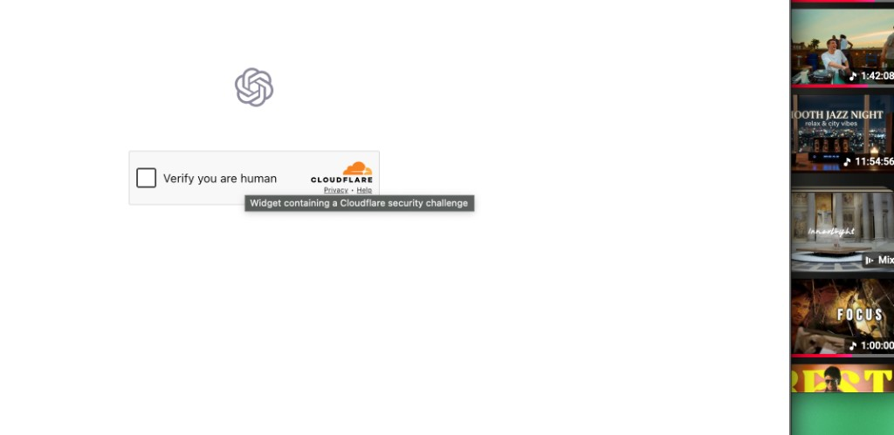

# chat-as-a-key

Self-hostable proxy that drives **Claude.ai, ChatGPT, Gemini, Grok, Perplexity, and Microsoft Copilot** in a real browser (Playwright), reuses **your** sessions, and exposes a small **REST** API. It is **not** those vendors’ official APIs.

> **Legal / terms:** read **[DISCLAIMER.md](DISCLAIMER.md)** in full. This project is not affiliated with Anthropic, OpenAI, Google, xAI, Perplexity, or Microsoft. Use is at your own risk; accounts can be limited or closed under provider rules.

---

## Smoke test results

Smoke: `GET /v1/health` then `POST /v1/chat` with  
`{"message": "Reply with exactly one word: pong"}`  
for **each provider enabled in `.env`**. Below is a **real run** committed to the README (refresh when you change sessions or code).

| Provider | Result | Notes |
| --- | --- | --- |
| `claude` | **OK** | Response contained `pong`. |
| `chatgpt` | **FAIL** | Composer never became visible — often a **bot / human gate** (see screenshot) or degraded headless UI, not only selectors. |
| `gemini` | **OK** | Response contained `pong`. |
| `grok` | **OK** | HTTP 200; **empty** assistant text in this run (still counted OK for connectivity). |
| `perplexity` | **FAIL** | Composer not visible within timeout. |
| `copilot` | **FAIL** | Composer not visible within timeout. |

**Recorded:** 2026-05-02 · **Environment:** dev machine, server at `http://127.0.0.1:8000`, 360s timeout per provider.

**Regenerate this table:** with the server running and `.env` loaded, from repo root:

```bash
source .venv/bin/activate
python scripts/smoke_test_providers.py --markdown
```

Copy the printed Markdown table and replace the block above. **`--catalog`** lists every supported provider vs your `*_ENABLED` flags (no HTTP).

---

### When “composer not visible” is a trust boundary, not a typo

Headless automation sometimes never reaches the chat shell. Example: **Cloudflare “Verify you are human”** on the way to ChatGPT — there is no message box yet, so every composer wait times out.



For **Grok vs Groq**, headless vs headed tradeoffs, and capture commands, see **[docs/PROVIDER_BROWSER_MATRIX.md](docs/PROVIDER_BROWSER_MATRIX.md)** (dated).

---

## Setup

**Step-by-step:** **[SETUP.md](SETUP.md)** (sessions, `.env`, Docker vs native, Claude profile / `SingletonLock`, troubleshooting).

```bash
git clone https://github.com/YOUR_GITHUB_USER/chat-as-a-key.git
cd chat-as-a-key
cp .env.example .env
pip install -r requirements.txt && playwright install chromium
python scripts/capture_session.py claude   # repeat per provider; see SETUP.md
# Edit .env: enable providers and set *_STORAGE_STATE / cookies
docker compose up --build    # or: python server.py
```

**URLs:** API `http://localhost:8000` · Dashboard `/dashboard` · OpenAPI `/docs`

---

### POST /v1/chat

Send a message to any enabled provider.

```bash
curl -X POST http://localhost:8000/v1/chat \
  -H "Content-Type: application/json" \
  -d '{
    "provider": "claude",
    "message": "Explain async/await in Python in two sentences."
  }'
```

**Multi-turn conversation** — pass the `conversation_id` returned from the first call:

```bash
curl -X POST http://localhost:8000/v1/chat \
  -H "Content-Type: application/json" \
  -d '{
    "provider": "claude",
    "message": "Now give me a code example.",
    "conversation_id": "abc123"
  }'
```

**Response:**

```json
{
  "provider": "claude",
  "message": "async/await lets you write concurrent code...",
  "conversation_id": "abc123",
  "model": "claude",
  "timestamp": 1714000000.0
}
```

### GET /v1/providers

List all enabled providers and their session status.

```bash
curl http://localhost:8000/v1/providers
```

### GET /v1/health

Overall proxy health check.

```bash
curl http://localhost:8000/v1/health
```

### GET /v1/status/{provider}

Per-provider session check.

```bash
curl http://localhost:8000/v1/status/claude
```

### GET /dashboard

Web UI showing all providers, session status, and request counts. Auto-refreshes every 15 seconds.

```
http://localhost:8000/dashboard
```

---

## Sessions and cookies

Use **`scripts/capture_session.py`** and `*_STORAGE_STATE` / `*_COOKIES` in `.env`. Details: **[SETUP.md](SETUP.md)**.

### Example: `httpx`

```python
import httpx

response = httpx.post(
    "http://localhost:8000/v1/chat",
    json={"provider": "claude", "message": "Write a haiku about Docker."},
)
print(response.json()["message"])
```

---

## Configuration reference

| Variable | Default | Description |
|---|---|---|
| `HOST` | `0.0.0.0` | Bind address |
| `PORT` | `8000` | Listen port |
| `LOG_LEVEL` | `info` | Uvicorn log level |
| `ENABLE_TRACING` | `false` | When `true`, adds Chrome `--remote-debugging-port` for **all** Playwright providers; on **empty reply or exception**, one traced retry (CDP + screenshots) under `.o11y/{run_id}/`. Successful requests unchanged. |
| `HEADLESS` | `true` | Playwright providers (non-Claude): headless Chrome/Chromium by default; set `false` for headed local debugging. |
| `CLAUDE_HEADLESS` | `false` | When `true`, Claude uses headless Chrome (containers); default `false` is visible Chrome. |
| `{PROVIDER}_ENABLED` | `false` | Enable a provider |
| `{PROVIDER}_COOKIES` | — | JSON cookie array |
| `{PROVIDER}_STORAGE_STATE` | — | Path: **directory** = persistent Chrome profile; **`.json`** = Playwright `storage_state` (Claude auto-detects). **Do not** open the same profile folder in manual Chrome while the server runs (Chrome `SingletonLock`). |

Supported provider prefixes: `CLAUDE`, `CHATGPT`, `GEMINI`, `GROK`, `PERPLEXITY`, `COPILOT`.

---

## Project structure

```
chat-as-a-key/
  browser/
    session_manager.py
    headless_chrome.py
    playwright_cleanup.py
    network_interceptor.py
    tracing_launch.py
    cdp_observer.py
    tracer.py
  core/
    orchestrator.py
    traced_send.py
  parsers/
    claude_parser.py
  providers/
    base.py
    claude.py
    chatgpt.py
    gemini.py
    grok.py
    perplexity.py
    copilot.py
  scripts/
    capture_session.py
    smoke_test_providers.py
  server.py
  config.py
  docker-compose.yml
  Dockerfile
  requirements.txt
  .env.example
  SETUP.md
  DISCLAIMER.md
  docs/
    PROVIDER_BROWSER_MATRIX.md
    assets/
      cloudflare-chatgpt-human-verify.png
```

---

## Adding a new provider

1. Create `providers/yourprovider.py` implementing `BaseProvider`.
2. Add it to `PROVIDER_MAP` in `providers/__init__.py`.
3. Add the `YOURPROVIDER_ENABLED` / `YOURPROVIDER_COOKIES` vars to `.env.example`.
4. For Playwright providers, use `chromium_tracing_args()` on launch and wrap `send_message` with `core.traced_send.send_with_optional_failure_trace` (see `chatgpt.py`) so `ENABLE_TRACING` failure retries work.

---

## License

MIT. Use of this software is subject to [DISCLAIMER.md](DISCLAIMER.md).
